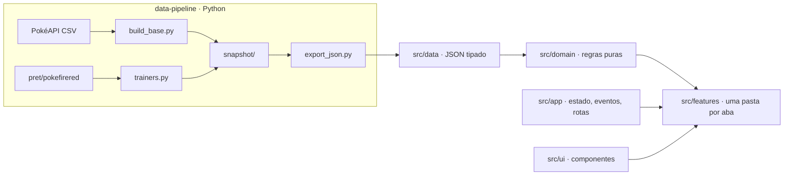

# FireRed Codex

[](https://github.com/Jhon-catanante/firered-codex/actions/workflows/ci.yml)
[](https://github.com/Jhon-catanante/firered-codex/actions/workflows/pages.yml)

Guia completo de **Pokémon FireRed & LeafGreen**, com dados corrigidos para a Geração III.

🔗 **https://jhon-catanante.github.io/firered-codex/**

## Funcionalidades

- **Pokédex (386)**: status, tipos e habilidades da Gen III, build recomendada, ranking de naturezas e todos os golpes.
- **Rotas**: chance real de encontro por área e método, com as exclusivas de cada versão.
- **Treino**: melhores lugares para EVs, tabela de naturezas e calculadora de status.
- **Times**: times prontos e montador com análise de fraquezas e cobertura.
- **Lendários**: onde capturar e chance por Ultra Ball pela fórmula de captura da Gen III.
- **Treinadores**: times exatos de ginásios, Elite Four e rival, extraídos do código do jogo, com sugestões do que capturar antes de cada batalha.

## Stack

TypeScript (strict) · Vite · Vitest · ESLint + Prettier · GitHub Actions · Python (pipeline de dados)

Sem framework de UI: a interface é renderizada com template strings e delegação de eventos.
Para um site de conteúdo com estado simples, isso mantém o bundle pequeno (≈ 80 KB gzip) sem
abrir mão de tipagem e organização.

## Arquitetura



```
src/
├── app/         estado global persistido, barramento de eventos, abas, tema
├── data/        JSON gerados pelo pipeline + repositório tipado com índices
├── domain/      regras do jogo sem DOM: fórmulas de status e captura, tipos,
│                naturezas, build recomendada, disponibilidade, progressão
├── features/    uma pasta por aba (dex, ficha, golpes, rotas, treino, times…)
├── styles/      CSS em camadas: tokens → base → layout → componentes → features
├── types/       modelos de domínio
└── ui/          componentes compartilhados (chips, ícones, radar, cenas)
tests/           testes unitários do domínio + regressão
data-pipeline/   scripts que geram src/data a partir das fontes
```

### Decisões técnicas

- **Dados corretos para a Gen III**: a PokéAPI devolve os valores atuais (Clefairy como Fada, Gengar com Cursed Body). O pipeline desfaz as mudanças posteriores usando as tabelas históricas. Detalhes em [`data-pipeline/README.md`](data-pipeline/README.md).
- **Categoria física/especial pelo tipo**: na Gen III, Shadow Ball é físico e Crunch é especial. A build recomendada considera isso ao escolher entre Ataque e Atq. Esp.
- **Domínio isolado da interface**: tudo em `src/domain` é função pura sobre os dados, o que permite testar as regras do jogo sem navegador.
- **Features desacopladas**: uma aba não importa outra. Abrir a ficha de um Pokémon ou uma área é feito por eventos (`pokemon:open`, `area:open`).
- **Sem arte oficial**: os visuais são originais (ícones por tipo, cenas por hábitat). O site não hospeda sprites nem ROMs.

## Rodando localmente

```bash
npm install
npm run dev        # servidor de desenvolvimento
npm test           # testes
npm run build      # build de produção em dist/
```

| Script              | O que faz                                       |
| ------------------- | ----------------------------------------------- |
| `npm run lint`      | ESLint com regras estritas do typescript-eslint |
| `npm run typecheck` | TypeScript em modo strict                       |
| `npm run format`    | Prettier                                        |
| `npm test`          | Vitest                                          |

Para regerar os dados: `./data-pipeline/run_all.sh` (requer Python 3 e pandas).

## Testes

- **Unitários** (`tests/domain`): fórmula de status, chance de captura, tabela de tipos, learnsets e ranking de naturezas, validados contra valores conhecidos do jogo.
- **Regressão** (`tests/regression`): golden master gerado da versão anterior do site. Garante que a build recomendada dos 386 Pokémon, a disponibilidade, as sugestões de captura, os lendários e os locais de EV não mudam sem intenção.

## Fluxo de trabalho

Branches `feat/`, `fix/`, `refactor/` e `chore/`, commits no padrão Conventional Commits e
pull request para a `main`. O CI roda lint, tipos, testes e build em todo PR; o merge na
`main` publica no GitHub Pages.

## Fontes

- [PokéAPI](https://github.com/PokeAPI/pokeapi): Pokédex, golpes, encontros e evoluções.
- [pret/pokefirered](https://github.com/pret/pokefirered): times de treinadores.

---

Projeto de fã, sem fins lucrativos e sem afiliação com Nintendo, Creatures ou GAME FREAK.
Pokémon é marca de seus respectivos donos.
